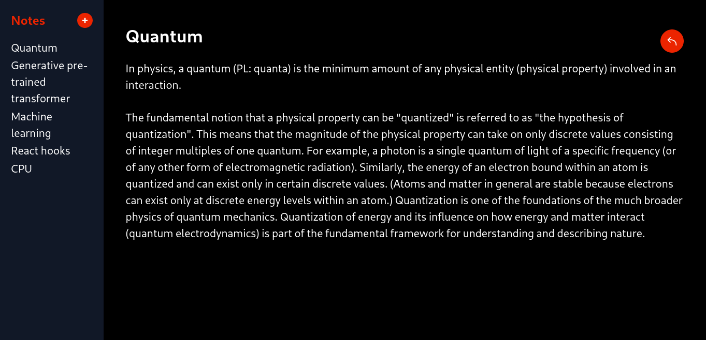

<h1 align="center">CHAINED NOTES WEB</h1>

A web interface for chained notes.



## BUILD PROCESS

### Dependencies

- [bun](https://github.com/oven-sh/bun)

### Getting started

1. Clone or download this repository.

   ```sh
   git clone https://github.com/msga-mmm/chained-notes-web.git
   cd chained-notes-web
   ```

2. Install build dependencies in the project directory.

   ```sh
   bun install
   ```

3. Run the web client with vite for local development.

   ```sh
   bun run dev
   ```

## Testing

To run the end-to-end tests is necessary to install first playwright:

```sh
bunx playwright install
```

The above command will install playwright for all the browsers: firefox, chrome and webkit. To install playwright for a specific browser the following command can be used:

```sh
# chrome
bunx playwright install chrome

# firefox
bunx playwright install firefox

# webkit
bunx playwright install webkit
```

After the installation finishes the tests can be run with the following command:

```sh
# all browsers (headless mode)
bun run test:e2e

# all browsers (ui mode)
bun run test:e2e:ui

# specific browser (headless mode)
bun run test:e2e:chrome

# specific browser (ui mode)
bun run test:e2e:chrome:ui
```

## Code design

### Dependencies

- AJV: this package is defined as a dev dependency to fix the issue between bun and orval `SyntaxError: Unexpected token ':'`. More information at https://github.com/orval-labs/orval/issues/1454

- eslint-plugin-react-hooks: this package is defined with the canary release `5.1.0` to solve the issue `TypeError: context.getSource is not a function`. More information at https://github.com/facebook/react/pull/28773
